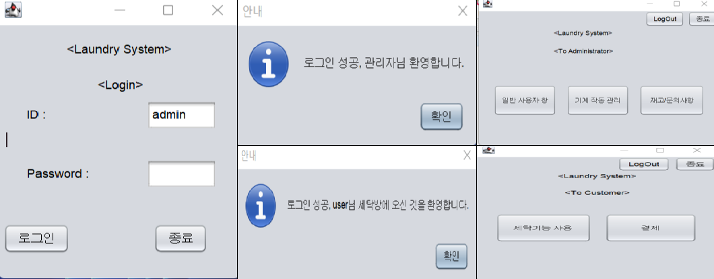
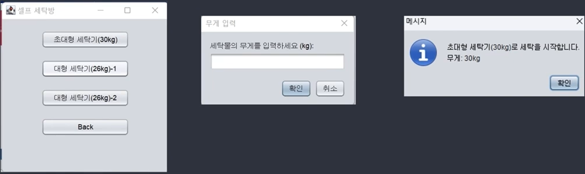
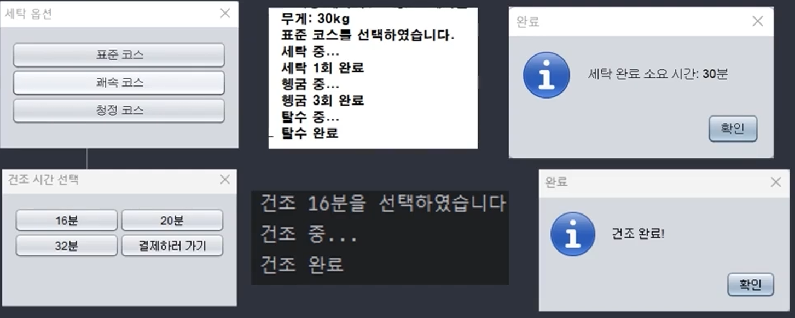
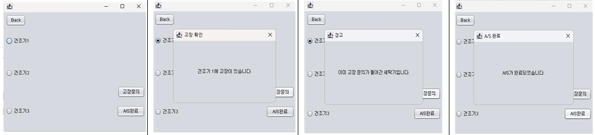
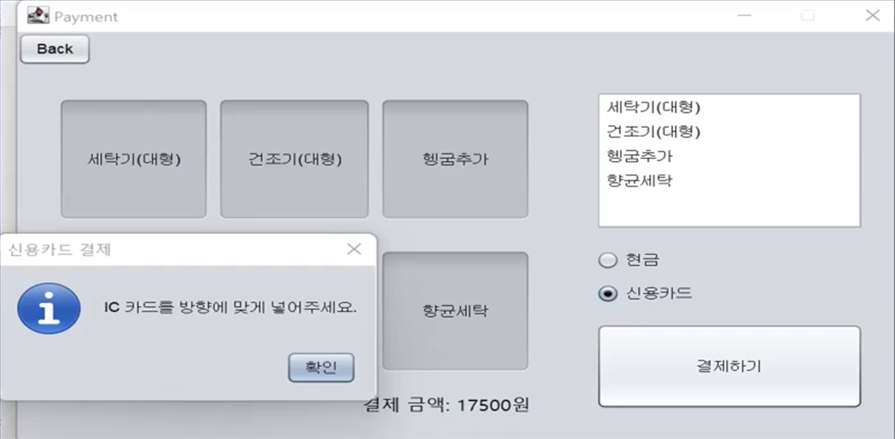

# 🧺 Laundry Management System

객체지향 설계 원칙과 다양한 디자인 패턴을 적용하여  
세탁방 운영 및 사용자 관리를 구현한 Java 기반 프로젝트입니다.

---

## 📌 프로젝트 소개

세탁방 사용자의 세탁 서비스 이용과  
관리자의 기기 및 재고 관리를 지원하는 시스템입니다.

다양한 디자인 패턴을 실제 기능에 적용하여  
유지보수성과 확장성을 고려한 구조로 설계하였습니다.

사용자와 관리자의 역할을 분리하였으며,  
세탁 옵션 선택, 기기 상태 관리, 결제 기능 등을 구현했습니다.

---

## 🛠 Tech Stack

### Language
- Java

### GUI
- Java Swing

### Build Tool
- Maven

### Environment
- NetBeans IDE
- Windows

### Software Engineering
- Object Oriented Design
- UML
- Design Patterns

---

## ✨ 주요 기능

- 사용자 / 관리자 로그인
- 사용자 권한에 따른 화면 분리
- 세탁기 및 건조기 선택
- 세탁 옵션 및 건조 옵션 선택
- 세탁 시간 계산 및 완료 알림
- 결제 시스템 구현
- 기기 상태 확인
- 고장 문의 및 A/S 처리
- 실시간 상태 알림 기능

---

## 🧩 적용한 디자인 패턴

### Facade Pattern
- 로그인 프로세스 단순화
- 복잡한 로그인 로직 캡슐화

### Factory Method Pattern
- 세탁물 무게에 따른 세탁기 객체 생성

### Strategy Pattern
- 세탁 및 건조 코스 전략 분리

### Observer Pattern
- 기기 상태 변경 및 알림 처리

### Command Pattern
- 결제 방식별 기능 분리

### Singleton Pattern
- 세탁기 인스턴스 관리

---

## 👨‍💻 담당 역할

- 세탁기 및 건조기 기능 구현
- Factory Method Pattern 기반 세탁기 객체 생성 로직 구현
- Strategy Pattern 기반 세탁/건조 코스 기능 구현
- Observer Pattern 기반 기기 상태 알림 기능 구현
- GUI 화면 및 사용자 인터페이스 구성
- 시스템 테스트 및 디버깅 참여
---

## 📷 Screenshots

### 🔐 Login & Role Management

---

### 🏭 Factory Method Pattern
세탁물 무게에 따라 적절한 세탁기 객체를 생성하도록 구현하였습니다.

---

### 🧼 Strategy Pattern
세탁 코스 및 건조 코스를 전략 객체로 분리하여 구현하였습니다.

---

### 📡 Observer Pattern
기기 고장 상태 변경 시 사용자에게 알림을 제공하도록 구현하였습니다.

---

### 💳 Command Pattern Payment System
결제 방식에 따라 서로 다른 결제 로직이 실행되도록 구현하였습니다.

---

## 📅 개발 기간

2024.04 ~ 2024.06

